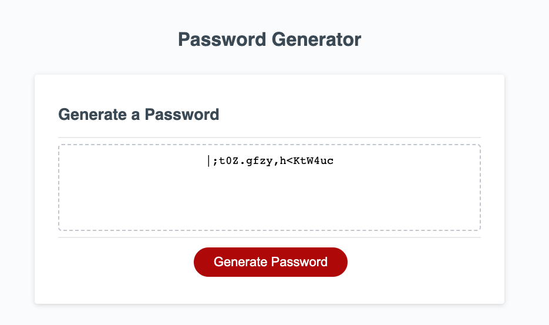

Application that allows users to select criteria to include in their randomly generated password. 

Criteria include:
- Length of password
- Lowercase letters
- Uppercase letters
- Numbers
- Special Characters

Screenshot

Link To Deployed Application

https://mycodesu.github.io/passwordGenerator/